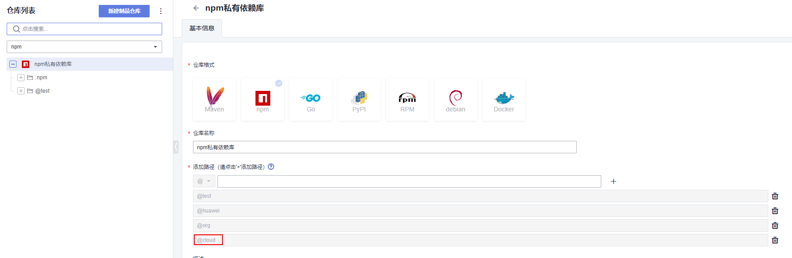

# 使用华为云CloudArtifact npm 私仓Workflow样例
私有依赖库(CloudArtifact)是发布服务（[CloudRelease](https://support.huaweicloud.com/cloudrelease/index.html)）的语言软件仓库功能。用于管理私有组件（开发者通俗称之为私服），包括Maven、Npm、Go、PyPI、Rpm等多种仓库格式。   
使用华为云CloudArtifact npm 私仓有如下场景：  
1.npm publish 推送npm package到 CloudArtifact npm 私仓   
2.npm install 拉取CloudArtifact npm 私仓的npm组件 

## **前置工作**
(1) [新建私有依赖库](https://support.huaweicloud.com/usermanual-releaseman/cloudrelease_01_0008.html)  
(2) [管理用户权限](https://support.huaweicloud.com/usermanual-releaseman/cloudrelease_01_0011.html)  
(3) CloudArtifact npm 私仓账号信息获取  
[私有依赖库首页](https://devcloud.cn-north-4.huaweicloud.com/cloudartifact/repository)->点击需要的npm仓库->右上角操作指导->点击下载配置文件->npm配置在下载的npmrc文件当中  


## 参数说明
npm-cloudartifact-action 参数都属于npm用户配置文件~/.npmrc文件的元素npm仓库`registry_list`和仓库认证信息`auth_list`。npm配置信息分为不包含@scope和包含[@scope](https://docs.npmjs.com/cli/v6/using-npm/scope)两种方式。目前华为云CloudArtifact npm 私仓支持的是scope方式，含scope的方式支持配置多仓库。下面给出两个参数的具体的样例。  

### 1.不包含@scope
.npmrc配置格式
```
registry=https://some.npm.registry/
_auth=(user:password).base64  # 用户名和密码中间用冒号隔开，通过base64编码后的字符串。如：_auth=dGVzdDoxMjM=
```
action中参数配置例子
```yml
steps:
- uses: huaweicloud/npm-cloudartifact-action@v1.0.0
  with: 
    registry_list: |
        registry=https://some.npm.registry/
    auth_list: |
        _auth=${{ secrets.NPM_AUTH }}
```
### 2.包含@scope，若@scope为"@cloud"
.npmrc配置格式
```
@cloud:registry=https://devrepo.devcloud.cn-north-4.huaweicloud.com/artgalaxy/api/npm/cn-north-4_xxx_npm_0/
//devrepo.devcloud.cn-north-4.huaweicloud.com/artgalaxy/api/npm/cn-north-4_xxx_npm_0/:_auth=(user:password).base64
```
action中参数配置例子
```yml
steps:
- uses: huaweicloud/npm-cloudartifact-action@v1.0.0
  with: 
    registry_list: |
        @cloud:registry=https://devrepo.devcloud.cn-north-4.huaweicloud.com/artgalaxy/api/npm/cn-north-4_xxxxx_npm_0/
    auth_list: |
        //devrepo.devcloud.cn-north-4.huaweicloud.com/artgalaxy/api/npm/cn-north-4_xxxxx_npm_0/:_auth=${{ secrets.NPM_AUTH }}
```

## **CloudArtifact npm 私仓Workflow样例**
### 1.npm publish 推送npm package到 CloudArtifact npm 私仓 
步骤说明：  
(1)代码检出   
(2)华为云CloudArtifact npm 私仓配置    
(3)npm publish 推送npm package到 CloudArtifact npm 私仓  
```yaml
name: npm Cloudartifact Action Publish Demo
on:
  push:
    branches:
       master
jobs:
  Publish-to-CloudArtifact-npm:
    runs-on: ubuntu-latest
    steps:
        # 代码检出
      - uses: actions/checkout@v2

        # 华为云CloudArtifact npm 私仓配置 
      - name: Setup HuaweiCloud npm CloudArtifact
        uses: huaweicloud/npm-cloudartifact-action@v1.0.0
        with: 
          registry_list: |
            @cloud:registry=https://devrepo.devcloud.cn-north-4.huaweicloud.com/artgalaxy/api/npm/cn-north-4_xxxxx_npm_0/
          auth_list: |
            //devrepo.devcloud.cn-north-4.huaweicloud.com/artgalaxy/api/npm/cn-north-4_xxxxx_npm_0/:_auth=${{ secrets.NPM_AUTH }}
            
        # 推送npm二进制包到华为云CloudArtifact npm 私仓
      - name: publish npm package 
        run: |
          npm publish
```   
详情可参考 ./github/workflow/npm-cloudartifact-action-pubilsh-demo.yml
>【注意】  
> 1.假设要推送的npm package名称为:@cloud/vue-demo (本仓库package.json文件中name值)  
> 2.私有依赖库CloudArtifact中npm私仓路径必须包含改@scope
>   
> 3.action参数registry_list包含@cloud的npm仓库  
> 4.使用到账号密码等敏感信息，建议将参数内容设置在GITHUB的Settings->Secrets->Actions

### 2.npm install 拉取CloudArtifact npm 私仓的npm package 
步骤说明：  
(1)代码检出   
(2)华为云CloudArtifact npm 私仓配置    
(3)npm install 拉取CloudArtifact npm 私仓的npm package   
```yaml
name: npm Cloudartifact Action Install Demo
on:
  push:
    branches:
       master
jobs:
  Publish-to-CloudArtifact-npm:
    runs-on: ubuntu-latest
    steps:
        # 代码检出
      - uses: actions/checkout@v2

        # 华为云CloudArtifact npm 私仓配置 
      - name: Setup HuaweiCloud npm CloudArtifact
        uses: huaweicloud/npm-cloudartifact-action@v1.0.0
        with: 
          registry_list: |
            registry=https://registry.npmjs.org/
            @cloud:registry=https://devrepo.devcloud.cn-north-4.huaweicloud.com/artgalaxy/api/npm/cn-north-4_xxxxx_npm_0/
          auth_list: |
            //devrepo.devcloud.cn-north-4.huaweicloud.com/artgalaxy/api/npm/cn-north-4_xxxxx_npm_0/:_auth=${{ secrets.NPM_AUTH }}
            
        # 拉取CloudArtifact npm 私仓的npm package
      - name: install npm package 
        run: |
          npm install
```
详情可参考 ./github/workflow/npm-cloudartifact-action-install-demo.yml
>【注意】  
> 1.npm仓库存在npm package @cloud/vue-demo   
> 2.package.json文件中name与要下载的npm package名称不能一致  
> 3.action参数registry_list包含@cloud的npm仓库  
> 4.使用到账号密码等敏感信息，建议将参数内容设置在GITHUB的Settings->Secrets->Actions